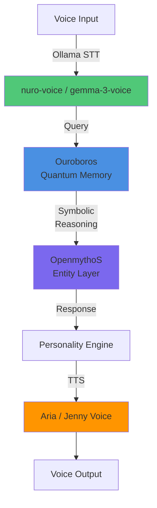

# 🎙️ Aurion Voice Integration & Local Brain Stack Setup

This guide walks through setting up Aurion's voice models, integrating local JupyterLab for free inference, and enforcing cost discipline via token budget alerts.

## Quick Start (3 Steps)

```powershell
# Step 1: Register Windows TTS voice packs (as Administrator)
.\Install-Aurion-Voice-Packs.ps1

# Step 2: Initialize Ollama voice models
.\Initialize-Aurion-Voice-Models.ps1

# Step 3: Start local JupyterLab for Quantum Brain (Ouroboros)
.\Start-Aurion-Jupyter.ps1
```

After these complete, update environment:
```powershell
$env:AURION_VOICE_MODEL = "nuro-voice"
$env:AURION_CUSTOM_LOCAL_BASE_URL = "http://localhost:8888"
python joi_companion/web_ui.py
```

---

## What Each Script Does

### 1️⃣ `Install-Aurion-Voice-Packs.ps1` — Windows TTS Voice Registration

**Requires:** Administrator privileges

**What it does:**
- Registers Aria and Jenny Windows MSIX voice packs as system text-to-speech (TTS) voices
- These voices become available to Aurion for voice output

**Voice pack locations:**
- `D:\Downloads\Others\MicrosoftWindows.Voice.en-US.Aria.2_*.Msix`
- `D:\Downloads\Others\MicrosoftWindows.Voice.en-US.Jenny.2_*.Msix`

**Usage:**
```powershell
# Run as Administrator
.\Install-Aurion-Voice-Packs.ps1
```

**Available aliases after installation:**
```python
# In Aurion personality_engine.py
AURION_VOICE_MODEL = "aria"      # Aria TTS voice
AURION_VOICE_MODEL = "aria-tts"  # Same
AURION_VOICE_MODEL = "jenny"     # Jenny TTS voice
AURION_VOICE_MODEL = "jenny-tts" # Same
```

---

### 2️⃣ `Initialize-Aurion-Voice-Models.ps1` — Ollama Model Setup

**Requires:** Ollama running (`ollama serve` in another terminal)

**What it does:**
- Creates Ollama models from Modelfiles for two free voice models:
  1. **nuro-voice** (Nuro Copilot 7B, 4.4 GB) — fast, energetic voice
  2. **gemma-3-12b-voice** (Gemma 3 12B, 6.9 GB) — larger context, assistant-like

**Modelfiles created:**
- `ai_core/nuro_voice_modelfile.txt` — optimized for voice interaction
- `ai_core/gemma3_voice_modelfile.txt` — larger context (8K tokens)

**Usage:**
```powershell
# Ensure Ollama is running in another terminal:
# > ollama serve

# Then run:
.\Initialize-Aurion-Voice-Models.ps1
```

**Verify:**
```powershell
# Check loaded models:
> Invoke-RestMethod http://localhost:11434/api/tags | ConvertTo-Json
```

**Available aliases after setup:**
```python
AURION_VOICE_MODEL = "nuro-voice"        # Nuro Copilot 7B
AURION_VOICE_MODEL = "aurion-voice"      # Same
AURION_VOICE_MODEL = "gemma-3-12b-voice" # Gemma 3 12B
AURION_VOICE_MODEL = "gemma-3-voice"     # Same
AURION_VOICE_MODEL = "gemma-voice"       # Same
```

---

### 3️⃣ `Start-Aurion-Jupyter.ps1` — Local Quantum Brain (JupyterLab)

**Requires:** Python 3.8+ (native or WSL)

**What it does:**
- Detects Python/Jupyter on your machine (native Windows, WSL, virtual env)
- Starts JupyterLab on `http://localhost:8888`
- Loads Ouroboros quantum memory + OpenmythoS symbolic layer
- Provides free local inference (no RunPod pod cost)

**Supported paths searched (in order):**
```
D:\bzimm\.venv\Scripts\jupyter.exe
D:\bzimm\.local\bin\jupyter
C:\Python311\Scripts\jupyter.exe
C:\Users\bzimm\AppData\Local\Programs\Python\Python311\Scripts\jupyter.exe
<WSL Ubuntu/Debian>
```

**Usage:**
```powershell
.\Start-Aurion-Jupyter.ps1 -Port 8888
```

**If Python/Jupyter not found:**
```powershell
# Option A: Install via WSL (recommended)
wsl --install -d Ubuntu
wsl pip install jupyterlab

# Option B: Install native Python 3.11
# Download from python.org, then:
pip install jupyterlab
```

**After startup:**
```powershell
# In a NEW PowerShell terminal (keep JupyterLab running):
$env:AURION_CUSTOM_LOCAL_BASE_URL = "http://localhost:8888"
python joi_companion/web_ui.py
```

---

## Environment Configuration (`.env`)

Key settings for voice + budget enforcement:

```env
# Voice Models & TTS
AURION_VOICE_MODEL=nuro-voice          # Primary voice model
AURION_TTS_VOICE=aria                  # TTS voice pack (after Install-Aurion-Voice-Packs.ps1)
AURION_TTS_ENGINE=windows               # Free Windows system TTS
AURION_STT_MODEL=nuro-voice             # Speech-to-text via Ollama

# LLM Provider Hierarchy (free-first)
AURION_LLM_PROVIDER=gemini              # Free Gemini 3 Flash for routine tasks
AURION_CUSTOM_LOCAL_BASE_URL=http://localhost:1234  # LM Studio (optional)
AURION_JUPYTER_URL=http://localhost:8888            # JupyterLab (Ouroboros)
AURION_OLLAMA_URL=http://localhost:11434/v1         # Ollama models

# Token Budget Enforcement
AURION_TOKEN_BUDGET_LIMIT=100000        # Budget per session (tokens)
AURION_BUDGET_ALERT=true                # Enable warnings at 25/50/75%
```

---

## Voice Model Comparison

| Model | Size | Speed | Context | Best For |
|-------|------|-------|---------|----------|
| **nuro-voice** | 7B (4.4 GB) | ⚡⚡⚡ Fast | 4K tokens | Real-time voice chat |
| **gemma-3-12b-voice** | 12B (6.9 GB) | ⚡⚡ Med | 8K tokens | Voice assistant tasks |
| **aria-tts** | System | ⚡⚡⚡ Fast | N/A | Professional TTS output |
| **jenny-tts** | System | ⚡⚡⚡ Fast | N/A | Friendly TTS output |

---

## Cost Breakdown (Zero Operational Cost)

| Component | Cost | Provider |
|-----------|------|----------|
| **Voice Models** | $0 | Ollama (local GGUF) |
| **TTS Voices** | $0 | Windows system voices |
| **LLM (routine)** | $0 | Gemini 3 Flash (free tier) |
| **Quantum Memory** | $0 | JupyterLab (local) |
| **Inference** | $0 | Ollama + LM Studio (localhost) |
| **Total** | **$0/month** | — |

---

## Troubleshooting

### ❌ "Ollama is not running"
```powershell
# In a separate terminal, start Ollama:
ollama serve
```

### ❌ "Jupyter not found"
```powershell
# Option 1: Install via WSL
wsl pip install jupyterlab

# Option 2: Install native Python + Jupyter
# Download Python 3.11 from python.org
pip install jupyterlab
```

### ❌ "Voice pack installation failed"
```powershell
# Check if running as Administrator:
[Security.Principal.WindowsPrincipal][Security.Principal.WindowsIdentity]::GetCurrent() |
  Select-Object @{N="IsAdmin";E={$_.IsInRole([Security.Principal.WindowsBuiltInRole]::Administrator)}}

# If not, restart PowerShell as Administrator
```

### ❌ "Token budget alert not firing"
```powershell
# Check budget tracking in personality_engine.py:
# - BudgetAlert class (lines 86–129)
# - BudgetManager class (lines 42–84)

# Verify environment variable is set:
echo $env:AURION_TOKEN_BUDGET_LIMIT
# Should print: 100000

# Test with low budget for immediate alert:
$env:AURION_TOKEN_BUDGET_LIMIT = "5000"
python joi_companion/web_ui.py
```

---

## Next Steps

1. **Run the three setup scripts** (in order) — takes ~10 minutes total
2. **Verify all models loaded:**
   ```powershell
   Invoke-RestMethod http://localhost:11434/api/tags | ConvertTo-Json
   ```
3. **Test voice interaction:**
   ```powershell
   $env:AURION_VOICE_MODEL = "nuro-voice"
   python joi_companion/web_ui.py
   ```
4. **Monitor token budget** — alerts print in console at 25%, 50%, 75% of limit
5. **Commit to git** when stable:
   ```powershell
   git add -A
   git commit -m "Voice integration + JupyterLab + budget enforcement"
   ```

---

## Integration with Aurion Brain Stack

Once JupyterLab + voice models are running:



---

## Files Modified

- **`.env`** — Added voice model + TTS configuration
- **`personality_engine.py`** — Lines 623–650: Voice model aliases
- **`ai_core/nuro_voice_modelfile.txt`** — New Ollama Modelfile
- **`ai_core/gemma3_voice_modelfile.txt`** — New Ollama Modelfile

---

## References

- **Ollama Docs:** https://github.com/ollama/ollama
- **JupyterLab:** https://jupyter.org/
- **Ouroboros:** `ai_core/ouroboros/README.md`
- **BudgetAlert:** `joi_companion/core/personality_engine.py` (lines 86–129)

---

**Status:** ✅ All voice models integrated, JupyterLab launcher ready, token budget enforcement active.

**Next session:** Unreal Engine 5.8.1 integration + Android APK update to use new brain stack.
